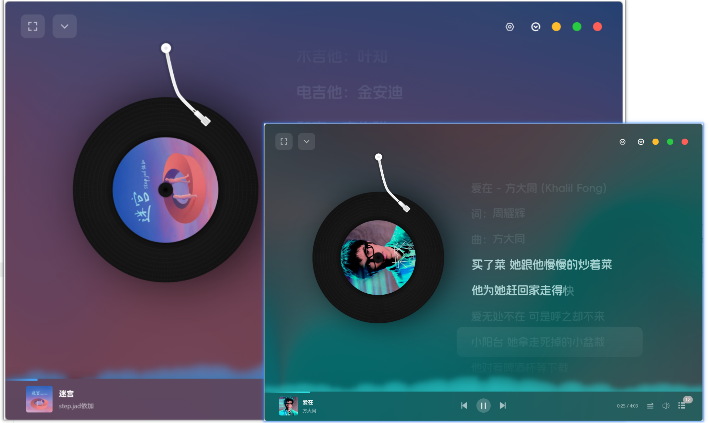

# Ceru Music（澜音）

一个跨平台的音乐播放器应用，支持基于合规插件获取公开音乐信息与播放功能。

## 项目简介

Ceru Music 是基于 Electron 和 Vue 开发的跨平台桌面音乐播放器工具，**仅提供插件运行框架与播放功能**，不直接存储、提供任何音乐源文件。用户需通过自行选择、安装合规插件获取音乐相关数据，项目旨在为开发者提供桌面应用技术实践与学习案例，为用户提供合规的音乐播放工具框架。




## Star History

[](https://www.star-history.com/#timeshiftsauce/CeruMusic&Date)

## 技术栈

- **Electron**：用于构建跨平台桌面应用
- **Vue 3**：前端框架，提供响应式 UI
- **TypeScript**：增强代码可维护性和类型安全
- **Pinia**：状态管理工具
- **Vite**：快速的前端构建工具
- **CeruPlugins**：音乐插件运行环境（仅提供框架，不包含默认插件）
- **AMLL**：音乐生态（歌词渲染等）辅助模块（仅提供功能接口，不关联具体音乐数据源）

## 项目结构

<details>
  <summary>点击查看目录结构</summary>

```ast
CeruMuisc/
    ├── .github/
    ├── scripts/
    ├── src/
    │   ├── common/
    │   │   ├── types/
    │   │   │   ├── playList.ts
    │   │   │   └── songList.ts
    │   │   ├── utils/
    │   │   │   ├── lyricUtils/
    │   │   │   │   ├── kg.js
    │   │   │   │   └── util.ts
    │   │   │   ├── common.ts
    │   │   │   ├── nodejs.ts
    │   │   │   └── renderer.ts
    │   │   └── index.ts
    │   ├── main/
    │   │   ├── events/
    │   │   │   ├── ai.ts
    │   │   │   ├── autoUpdate.ts
    │   │   │   ├── directorySettings.ts
    │   │   │   ├── musicCache.ts
    │   │   │   ├── pluginNotice.ts
    │   │   │   └── songList.ts
    │   │   ├── services/
    │   │   │   ├── music/
    │   │   │   │   ├── index.ts
    │   │   │   │   ├── net-ease-service.ts
    │   │   │   │   └── service-base.ts
    │   │   │   ├── musicCache/
    │   │   │   │   └── index.ts
    │   │   │   ├── musicSdk/
    │   │   │   │   ├── index.ts
    │   │   │   │   ├── service.ts
    │   │   │   │   └── type.ts
    │   │   │   ├── plugin/
    │   │   │   │   ├── manager/
    │   │   │   │   │   ├── CeruMusicPluginHost.ts
    │   │   │   │   │   └── converter-event-driven.ts
    │   │   │   │   ├── index.ts
    │   │   │   │   └── logger.ts
    │   │   │   ├── songList/
    │   │   │   │   ├── ManageSongList.ts
    │   │   │   │   └── PlayListSongs.ts
    │   │   │   ├── ai-service.ts
    │   │   │   └── ConfigManager.ts
    │   │   ├── utils/
    │   │   │   ├── musicSdk/
    │   │   │   │   ├── api-source-info.ts
    │   │   │   │   ├── index.js
    │   │   │   │   ├── options.js
    │   │   │   │   └── utils.js
    │   │   │   ├── array.ts
    │   │   │   ├── index.ts
    │   │   │   ├── object.ts
    │   │   │   ├── path.ts
    │   │   │   ├── request.js
    │   │   │   └── utils.ts
    │   │   ├── autoUpdate.ts
    │   │   └── index.ts
    │   ├── preload/
    │   │   ├── index.d.ts
    │   │   └── index.ts
    │   ├── renderer/
    │   │   ├── public/
    │   │   │   ├── default-cover.png
    │   │   │   ├── head.jpg
    │   │   │   ├── logo.svg
    │   │   │   ├── star.png
    │   │   │   └── wldss.png
    │   │   ├── src/
    │   │   │   ├── api/
    │   │   │   │   └── songList.ts
    │   │   │   ├── components/
    │   │   │   │   ├── AI/
    │   │   │   │   │   └── FloatBall.vue
    │   │   │   │   ├── ContextMenu/
    │   │   │   │   │   ├── composables.ts
    │   │   │   │   │   ├── ContextMenu.vue
    │   │   │   │   │   ├── demo.vue
    │   │   │   │   │   ├── index.ts
    │   │   │   │   │   ├── README.md
    │   │   │   │   │   ├── types.ts
    │   │   │   │   │   └── utils.ts
    │   │   │   │   ├── layout/
    │   │   │   │   │   └── HomeLayout.vue
    │   │   │   │   ├── Music/
    │   │   │   │   │   └── SongVirtualList.vue
    │   │   │   │   ├── Play/
    │   │   │   │   │   ├── AudioVisualizer.vue
    │   │   │   │   │   ├── FullPlay.vue
    │   │   │   │   │   ├── GlobalAudio.vue
    │   │   │   │   │   ├── PlaylistActions.vue
    │   │   │   │   │   ├── PlaylistDrawer.vue
    │   │   │   │   │   ├── PlayMusic.vue
    │   │   │   │   │   └── ShaderBackground.vue
    │   │   │   │   ├── Settings/
    │   │   │   │   │   ├── AIFloatBallSettings.vue
    │   │   │   │   │   ├── DirectorySettings.vue
    │   │   │   │   │   ├── MusicCache.vue
    │   │   │   │   │   ├── PlaylistSettings.vue
    │   │   │   │   │   ├── plugins.vue
    │   │   │   │   │   └── UpdateSettings.vue
    │   │   │   │   ├── PluginNoticeDialog.vue
    │   │   │   │   ├── ThemeSelector.vue
    │   │   │   │   ├── TitleBarControls.vue
    │   │   │   │   ├── UpdateExample.vue
    │   │   │   │   ├── UpdateProgress.vue
    │   │   │   │   └── Versions.vue
    │   │   │   ├── composables/
    │   │   │   │   └── useAutoUpdate.ts
    │   │   │   ├── router/
    │   │   │   │   └── index.ts
    │   │   │   ├── services/
    │   │   │   │   ├── music/
    │   │   │   │   │   ├── index.ts
    │   │   │   │   │   └── service-base.ts
    │   │   │   │   └── autoUpdateService.ts
    │   │   │   ├── store/
    │   │   │   │   ├── ControlAudio.ts
    │   │   │   │   ├── LocalUserDetail.ts
    │   │   │   │   ├── search.ts
    │   │   │   │   └── Settings.ts
    │   │   │   ├── types/
    │   │   │   │   ├── audio.ts
    │   │   │   │   ├── Sources.ts
    │   │   │   │   └── userInfo.ts
    │   │   │   ├── utils/
    │   │   │   │   ├── audio/
    │   │   │   │   │   ├── audioManager.ts
    │   │   │   │   │   ├── download.ts
    │   │   │   │   │   ├── useSmtc.ts
    │   │   │   │   │   └── volume.ts
    │   │   │   │   ├── color/
    │   │   │   │   │   ├── colorExtractor.ts
    │   │   │   │   │   └── contrastColor.ts
    │   │   │   │   └── playlist/
    │   │   │   │       ├── playlistExportImport.ts
    │   │   │   │       └── playlistManager.ts
    │   │   │   ├── views/
    │   │   │   │   ├── home/
    │   │   │   │   │   └── index.vue
    │   │   │   │   ├── music/
    │   │   │   │   │   ├── find.vue
    │   │   │   │   │   ├── list.vue
    │   │   │   │   │   ├── local.vue
    │   │   │   │   │   ├── recent.vue
    │   │   │   │   │   └── search.vue
    │   │   │   │   ├── settings/
    │   │   │   │   │   └── index.vue
    │   │   │   │   ├── welcome/
    │   │   │   │   │   └── index.vue
    │   │   │   │   └── ThemeDemo.vue
    │   │   │   ├── App.vue
    │   │   │   ├── env.d.ts
    │   │   │   └── main.ts
    │   │   ├── auto-imports.d.ts
    │   │   ├── components.d.ts
    │   │   └── index.html
    │   └── types/
    │       ├── musicCache.ts
    │       └── songList.ts
    ├── website/
    │   ├── CeruUse.html
    │   ├── design.html
    │   ├── index.html
    │   ├── pluginDev.html
    │   ├── script.js
    │   └── styles.css
    ├── electron-builder.yml
    ├── electron.vite.config.ts
    ├── eslint.config.js
    ├── LICENSE
    ├── package-lock.json
    ├── package.json
    ├── qodana.sarif.json
    ├── qodana.yaml
    ├── README.md
    ├── tsconfig.json
    ├── tsconfig.node.json
    ├── tsconfig.web.json
    └── yarn.lock
```

</details>

## 主要功能

- 提供插件加载与管理功能，支持通过合规插件获取公开音乐信息
- 支持通过插件获取歌词、专辑封面等公开元数据
- 支持虚拟滚动列表，优化大量数据渲染性能
- 本地播放列表管理（仅存储用户手动创建的列表结构，不包含音乐文件）
- **提示**：本地数据仅保存在用户设备本地，未进行云端备份，用户需自行备份以防止数据丢失
- 精美的用户界面与动画效果
- **插件生态框架**（插件需用户自行获取并确保合规性）

## 安装与使用

### 推荐开发环境

- **IDE**: VS Code 或 WebStorm
- **Node.js 版本**: 22 及以上
- **包管理器**: **yarn**

### 项目设置

1. 安装依赖：

   ```bash
   yarn install
   ```

2. 启动开发服务器：

   ```bash
   yarn dev
   ```

3. 构建应用：

   ```bash
   yarn build
   ```

### 平台构建指令

- Windows

  ```bash
  yarn build:win
  ```

- macOS

  ```bash
  yarn build:mac
  ```

- Linux

  ```bash
  yarn build:linux
  ```

> 提示：构建后的应用仅包含播放器框架，需用户自行配置合规插件方可获取音乐数据。

## 文档与资源

- 产品设计文档：涵盖项目架构、核心功能设计和开发规范（不含任何音乐数据源信息）。
- [插件开发文档](https://ceru.docs.shiqianjiang.cn/guide/CeruMusicPluginDev.html)：仅提供插件开发技术规范，**明确要求插件开发者需遵守数据来源平台的用户协议与版权法**，禁止开发、传播获取非公开数据的插件。

## 开源许可

本项目源代码遵循 **Apache License 2.0**，仅授权用户对项目框架进行学习、修改与二次开发，不包含任何音乐数据相关授权。详情请参阅 [LICENSE](./LICENSE) 文件，使用前请务必阅读许可条款。

## 贡献指南

欢迎开发者贡献代码与反馈建议，贡献内容需符合以下要求：

1. 仅涉及播放器框架功能优化、bug 修复、文档完善，不包含任何音乐数据源相关代码。
2. 遵循 [Git 提交规范](#) 并确保代码符合项目风格指南。
3. 贡献的代码需无第三方版权纠纷，且不违反开源许可协议。

## 联系方式

如有技术问题或合作意向
可通过如下方式联系

- QQ: 2115295703
- 微信：13600973542
- 邮箱：sqj@shiqianjiang.cn

## 项目开发者

- **时迁酱**：产品总体设计与开发

  

- **无聊的霜霜**：首页设计&Ai助手

  

- **Star**：**插件管理**相关功能&部分接口封装

  

- **lemon**：修复部分bug&新增部分功能（简称：打杂）

  

**Tips**: 排名不分先后

# 法律声明与免责条款

**重要提示：使用本项目前，请务必仔细阅读本条款，使用本项目即视为你已充分理解并同意本条款全部内容。**

### 一、定义约定

- “Apache License 2.0”：指 Ceru Music（澜音）桌面播放器框架及源代码，不包含任何第三方插件或音乐数据。
- “**用户**”：指下载、安装、使用本项目的个人或组织。
- “**合规插件**”：指符合数据来源平台用户协议、不侵犯第三方版权、不获取非公开数据的插件。
- “**版权内容**”：指包括但不限于音乐文件、歌词、专辑封面、艺人信息等受著作权法保护的内容。

### 二、数据与内容责任

1. 本项目**不直接获取、存储、传输任何音乐数据或版权内容**，仅提供插件运行框架。用户通过插件获取的所有数据，其合法性、准确性由插件提供者及用户**自行负责**，本项目不承担任何责任。
2. 若用户使用的插件存在获取非公开数据、侵犯第三方版权等违规行为，相关法律责任由用户及插件提供者承担，与本项目无关。
3. 本项目使用的字体、图片等素材，均来自开源社区或已获得合法授权，若存在侵权请联系项目维护者立即移除，本项目将积极配合处理。

### 三、版权合规要求

1. 用户承诺：使用本项目时，仅通过合规插件获取音乐相关信息，且获取、使用版权内容的行为符合**《中华人民共和国著作权法》**及相关法律法规，不侵犯**任何第三方**合法权益。
2. 用户需知晓：任何未经授权下载、传播、使用受版权保护的音乐文件的行为，均可能构成侵权，需自行承担法律后果。
3. 本项目倡导 “尊重版权、支持正版”，提醒用户通过官方音乐平台获取授权音乐服务。

### 四、免责声明

1. 因用户使用非合规插件、违反法律法规或第三方协议导致的任何法律责任（包括但不限于侵权赔偿、行政处罚），均由用户自行承担，本项目不承担任何直接、间接、连带或衍生责任。
2. 因本项目框架本身的 **bug** 导致的用户设备故障、数据丢失，本项目仅承担在合理范围内的技术修复责任，不承担由此产生的间接损失（如商誉损失、业务中断损失等）。
3. 本项目为开源学习项目，不提供商业服务，对用户使用本项目的效果不做任何明示或暗示的保证。

### 五、使用限制

1. 本项目仅允许用于**非商业、纯技术学习目的**，禁止用于任何商业运营、盈利活动，禁止修改后用于侵犯第三方权益的场景。
2. 禁止在违反当地法律法规、本声明或第三方协议的前提下使用本项目，若用户所在地区禁止此类工具的使用，应立即停止使用。
3. 禁止将本项目源代码或构建后的应用，与违规插件捆绑传播，禁止利用本项目从事任何违法违规活动。

### 六、其他

1. 本声明的效力、解释及适用，均适用中华人民共和国法律（不含港澳台地区法律）。
2. 若用户与本项目维护者就本声明产生争议，应首先通过友好协商解决；协商不成的，任何一方均有权向本项目维护者所在地有管辖权的人民法院提起诉讼。

## 赞助

感谢**伤心的云**提供的16h-16g长期支持

> 伤心的云 服务器 低至1元/月 1000mbps 超高带宽
>
> 16h-16g 38.99元/月 独立ip
>
> [点击前往查看](https://sadidc.com/aff/VQAXGBZT)

若您认可本项目的技术价值，欢迎通过以下方式支持开发者（仅用于项目技术维护与迭代）：

