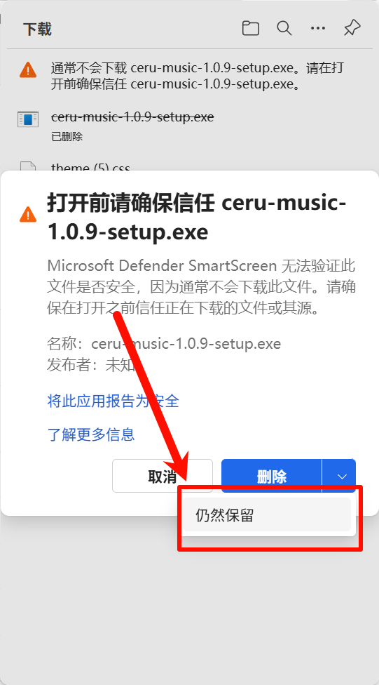
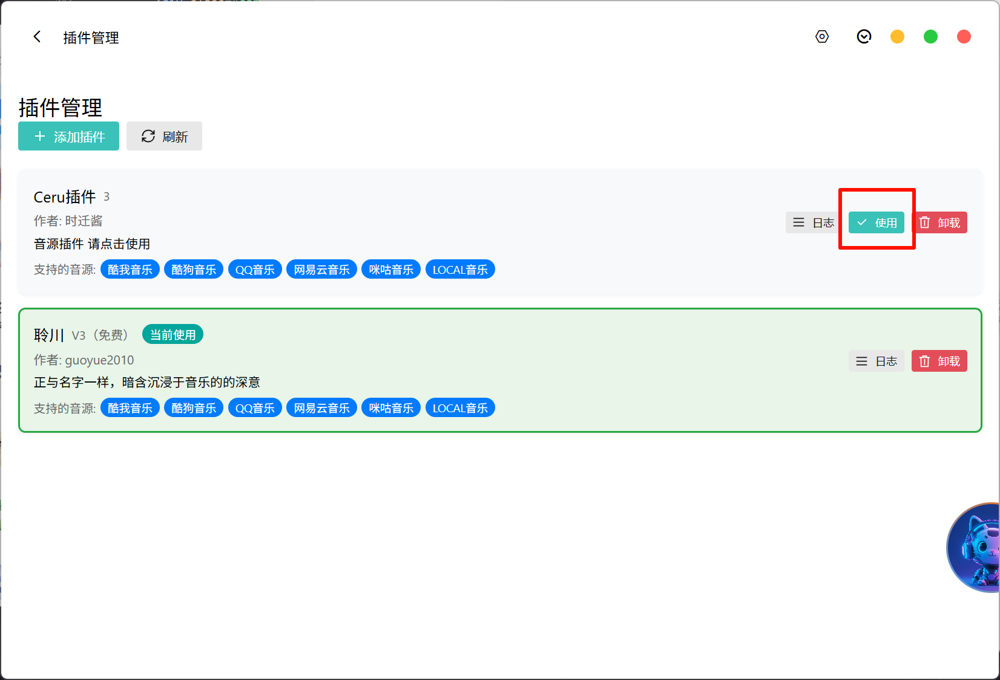

# CeruMusic 使用教程

## 1. 软件下载

​ 由于我们团段都是个人开发者原因 暂时无能力部署到 `OSS` 承担高下载量的能力，供大家下载只能通过[Github](https://github.com/timeshiftsauce/CeruMusic)下载安装使用

### Window 安装

由于没有证书原因 **`Window`** 平台可能会出现安装包体误报**危险**。请放心我们的软件都是**开源**在 `Github` 自动化打包的。**具体安装步骤如下**

如果出现类似图例效果请先点击 **右侧 三个点**

**点击保留**

**点击下拉按钮**

**任然保留**就可以双击打开安装到此教程结束

### Mac OS 系统下载安装

由于同样没有**签名**的原因mac的护栏也会拦截提示安装包损坏

请不用担心这是典型的签名问题

适用于 macOS 14 Sonoma 及以上版本。

注意：由于我们不提供经过签名的程序包体，因此在安装后首次运行可能会出现 “**澜音** 已损坏” 之类的提示，此时只需打开终端，输入命令

```bash
sudo xattr -r -d com.apple.quarantine /Applications/澜音.app
```

并回车，输入密码再次回车，重新尝试启动程序即可

_要是还有问题可自行在搜索引擎查询由于 。`apple`官方证书需要99刀的价格实在无能为力见谅_ 如果你有能力成为`澜音`的赞助者可联系

- QQ：`2115295703`
- 微信：`cl_wj0623`

### 插件安装

首次进入应用需要在软件右上角设置导入**音源**才能使用可查询`Ceru插件`**(目前生态欠缺)** 或现成的**落雪**插件导入使用

###### 导入完成点击使用
