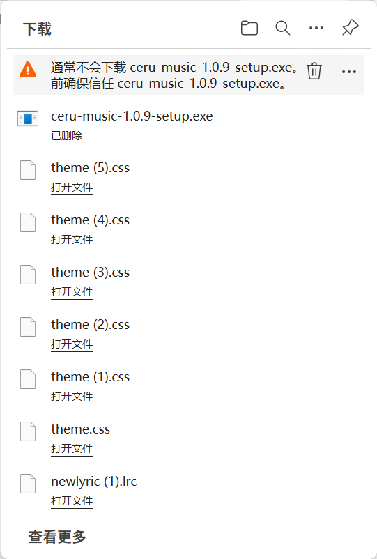
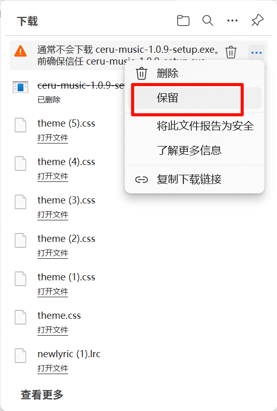
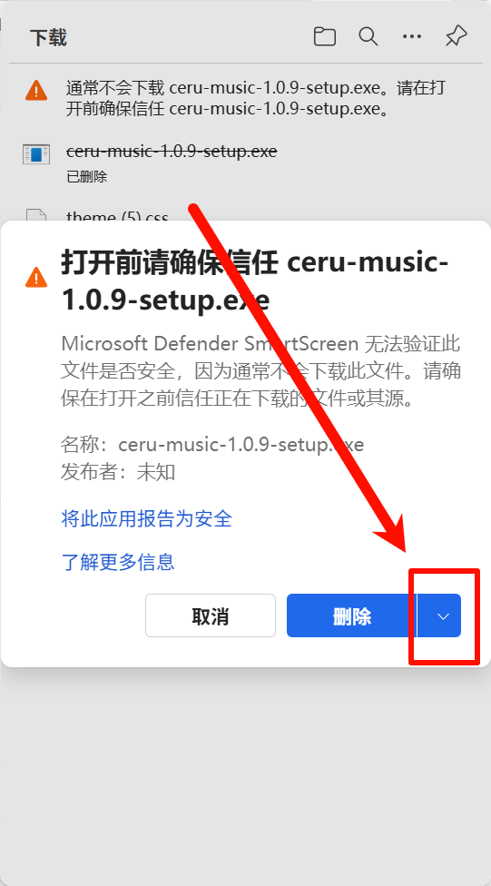
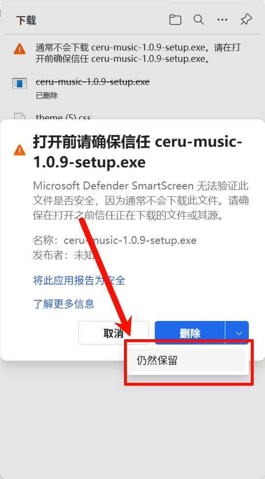
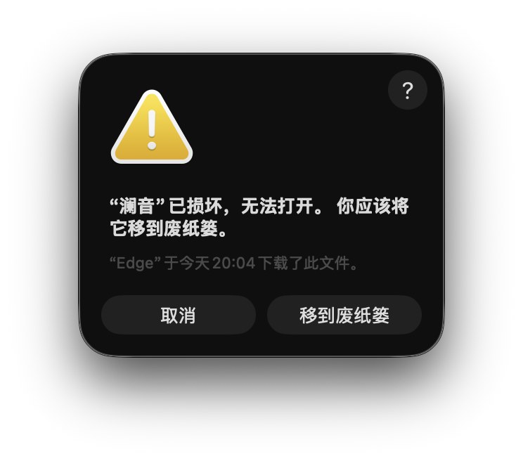
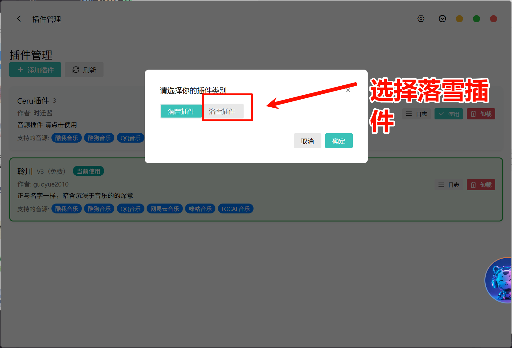
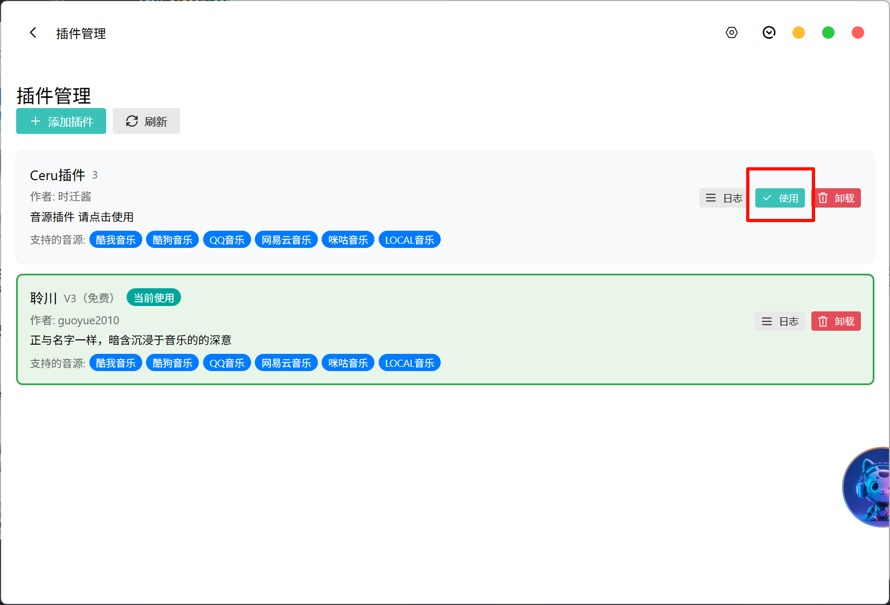

# CeruMusic 使用教程

## 1. 软件下载

​ 由于我们团队都是个人开发者原因 暂时无能力部署到 `OSS` 承担高下载量的能力，供大家下载只能通过[Github](https://github.com/timeshiftsauce/CeruMusic)下载安装使用

### Window 安装

由于没有证书原因 **`Window`** 平台可能会出现安装包体误报**危险**。请放心我们的软件都是**开源**在 `Github` 自动化打包的。**具体安装步骤如下**

如果出现类似图例效果请先点击 **右侧 三个点**

**点击保留**

**点击下拉按钮**

**任然保留**就可以双击打开安装到此教程结束

### Mac OS 系统下载安装

由于同样没有**签名**的原因mac的护栏也会拦截提示安装包损坏

请不用担心这是典型的签名问题

适用于 macOS 14 Sonoma 及以上版本。

注意：由于我们不提供经过签名的程序包体，因此在安装后首次运行可能会出现 “**澜音** 已损坏” 之类的提示，此时只需打开终端，输入命令

```bash
sudo xattr -r -d com.apple.quarantine /Applications/澜音.app
```

并回车，输入密码再次回车，重新尝试启动程序即可

_要是还有问题可自行在搜索引擎查询由于 。`apple`官方证书需要99刀的价格实在无能为力见谅_ 如果你有能力成为`澜音`的赞助者可联系

- QQ：`2115295703`
- 微信：`cl_wj0623`

### 插件安装

澜音 **1.14.1 起**使用插件 v2。在设置的插件管理中安装作者提供的单个 `plugin.js`，检查插件信息后点击“使用”或启用。需要网络等能力时，软件会请求对应授权。


*澜音 1.14.1 开发构建中的文档演示插件。*

LX 等外部脚本需要先安装相应 **v2 兼容环境插件**，再从该环境导入；不能将旧脚本直接当成 v2 成品。插件需要作者自行实现并合法提供数据能力。

开发者请阅读 [v2 快速开始](/guide/plugins/v2/quick-start)，版本关系见 [兼容表](/guide/plugins/v2/#兼容关系)。

::: details 旧版桌面安装界面（v1 历史资料）
以下截图属于旧 v1 插件系统，新版按钮与兼容方式以当前插件管理为准。




:::
