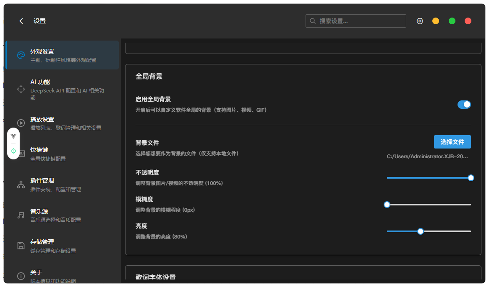

# 外观与主题设置指南

## 一、文档概述

- **文档目的：** 指导用户在 Ceru Music 中自定义应用外观，包括标题栏风格、主题色、全局背景、歌词字体及桌面歌词样式。
- **功能简介：** 外观设置提供标题栏控制按钮风格切换、关闭按钮行为、应用主题色、全局背景图、歌词字体大小与字重、桌面歌词外观等多维度个性化定制能力。
- **适用平台：** Windows、macOS 桌面客户端
- **适用用户：** 希望个性化应用界面的普通用户

## 二、使用前提

- 已安装 Ceru Music（澜音）最新版本。
- 打开「设置」页面：点击右上角的设置图标，或从任意页面进入。

## 三、各设置项说明

### 3.1 标题栏风格

Ceru Music 支持两种标题栏控制按钮风格，可根据个人喜好或操作习惯选择。

| 风格 | 说明 |
|------|------|
| Windows 风格 | 最小化、最大化、关闭按钮排列在右侧，适合 Windows 用户习惯 |
| 红绿灯风格 | 仿 macOS 三色圆形按钮，适合习惯 macOS 界面的用户 |

**操作步骤：**

1. 进入「设置 → 外观」。
2. 在「标题栏风格」区域，点击「Windows 风格」或「红绿灯风格」按钮进行切换。
3. 预览区域会实时展示两种风格的效果。
4. 设置立即生效，刷新应用窗口可见变化。

### 3.2 关闭按钮行为

设置点击窗口关闭按钮（或红绿灯风格中的红色按钮）时的行为。

| 选项 | 说明 |
|------|------|
| 开启（最小化到托盘） | 点击关闭时，应用退到系统托盘，音乐继续播放，可从托盘图标重新打开 |
| 关闭（直接退出应用） | 点击关闭时，应用完全退出，音乐停止播放 |

**操作步骤：**

1. 进入「设置 → 外观 → 基础外观」。
2. 找到「关闭按钮行为」开关，切换开启/关闭状态。
3. 开关旁边的文字会实时显示当前行为描述。

### 3.3 应用主题色

选择贯穿整个应用界面的主题颜色。

**操作步骤：**

1. 进入「设置 → 外观 → 应用主题色」。
2. 在主题选择器中点击喜欢的颜色方案。
3. 应用界面（按钮、强调色、进度条等）立即更新为所选颜色。

### 3.4 节日主题（限时体验）

在特定节日期间，应用会提供限时节日主题（如春节主题）。

- 节日期间进入「设置 → 外观」，如果有可用节日主题，将显示「节日主题」区域。
- 如不喜欢，点击「关闭春节主题」按钮可关闭。
- 已关闭时，可点击「开启春节主题」重新开启。

### 3.5 全局背景

为应用窗口设置全局背景图片或视觉效果。

**操作步骤：**

1. 进入「设置 → 外观 → 全局背景」。
2. 根据界面提示选择背景图片或背景效果。

### 3.6 歌词字体设置

调整全屏播放界面歌词的字体大小和字重，让歌词更易读或更具风格。

**操作步骤：**

1. 进入「设置 → 外观 → 歌词字体设置」（或拖动到该卡片）。
2. 调整「字体大小」滑块，实时预览歌词字号变化。
3. 选择「字体粗细」（如常规、加粗），以满足美观需求。
4. 修改后进入全屏播放可查看最终效果。

### 3.7 桌面歌词样式

桌面歌词是在主窗口外悬浮于桌面的歌词条，方便在全屏应用或游戏场景中查看歌词。

**外观设置项包括（在「设置 → 外观 → 桌面歌词样式」中）：**

- 字体大小
- 字体颜色
- 背景色及透明度
- 文字描边 / 阴影效果

**开启桌面歌词：**

- 方法一：通过全局快捷键（默认可在「设置 → 快捷键」中查看或设置）切换桌面歌词显示/隐藏。
- 方法二：在分享/更多菜单中找到「桌面歌词」开关。

### 3.8 全屏播放性能设置

以下选项影响全屏播放界面的视觉效果和设备性能消耗（位于「设置 → 播放 → 全屏播放-性能优化」）：

| 选项 | 说明 | 性能影响 |
|------|------|---------|
| 跳动歌词 | 使用弹簧引擎让歌词带有弹性跳动效果 | 较高 |
| 背景动画 | 全屏播放时显示布朗运动背景动画 | 较高 |
| 音频可视化 | 显示实时频谱/波形可视化条形图 | 较高 |
| 路由预加载 | 空闲时预加载页面组件，提升页面切换速度 | 较低 |

低配置设备建议关闭「跳动歌词」「背景动画」「音频可视化」以保证流畅体验。

## 四、操作结果

- 标题栏风格切换成功：窗口标题栏控制按钮区域更新为所选风格。
- 主题色更改成功：应用内所有主色调（按钮、高亮、进度条）立即更新。
- 全局背景设置成功：应用窗口背景更新为所选图片或效果。
- 桌面歌词样式修改成功：下次打开桌面歌词时以新样式显示。

## 五、注意事项

- 标题栏风格仅影响按钮的视觉样式，两种风格的功能相同。
- 在 Windows 系统上选择「红绿灯风格」属于视觉模拟，实际系统行为与 macOS 一致性存在差异。
- 卸载应用不会保存主题设置，重新安装后需重新配置。
- 全屏播放性能选项建议根据实际设备性能合理开启，低配机器开启过多高性能效果可能导致卡顿或 CPU 占用过高。

## 六、常见问题

**Q1：切换标题栏风格后没有变化，怎么处理？**

A：部分情况下需要重启应用后生效，请尝试关闭并重新打开 Ceru Music。

**Q2：关闭按钮的「最小化到托盘」开启后，在哪里找到应用图标重新打开？**

A：应用最小化到托盘后，在系统任务栏右侧（Windows）或菜单栏（macOS）的通知区域找到 Ceru Music 图标，双击或右键点击图标选择「显示主窗口」即可恢复。

**Q3：桌面歌词开启后在其他应用上方挡住内容，如何处理？**

A：桌面歌词为悬浮窗口，会显示在其他应用上方。可通过快捷键快速隐藏，或在桌面歌词样式设置中调整透明度使其不干扰阅读。

**Q4：全屏播放时背景动画导致内存占用很高怎么办？**

A：进入「设置 → 播放 → 全屏播放-性能优化」，关闭「背景动画」和「音频可视化」开关，可有效降低资源消耗。

## 七、相关文档

- [快捷键设置](/guide/used/hotkeys)
- [音效与均衡器设置](/guide/used/audio-effects)
