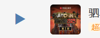
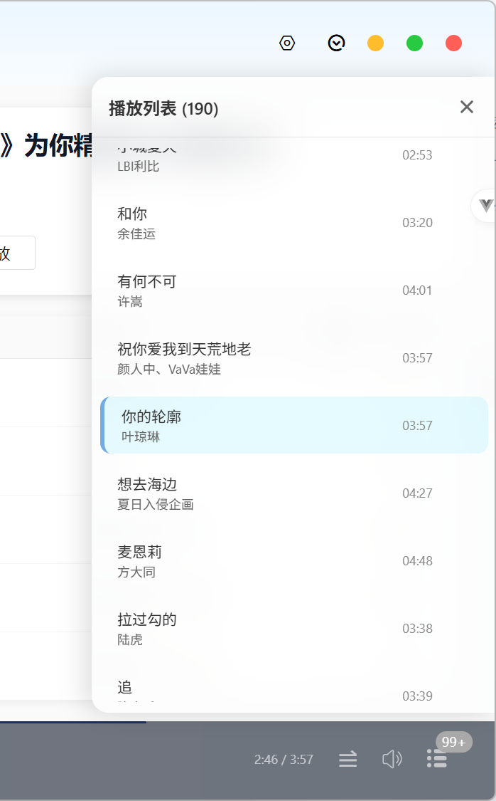
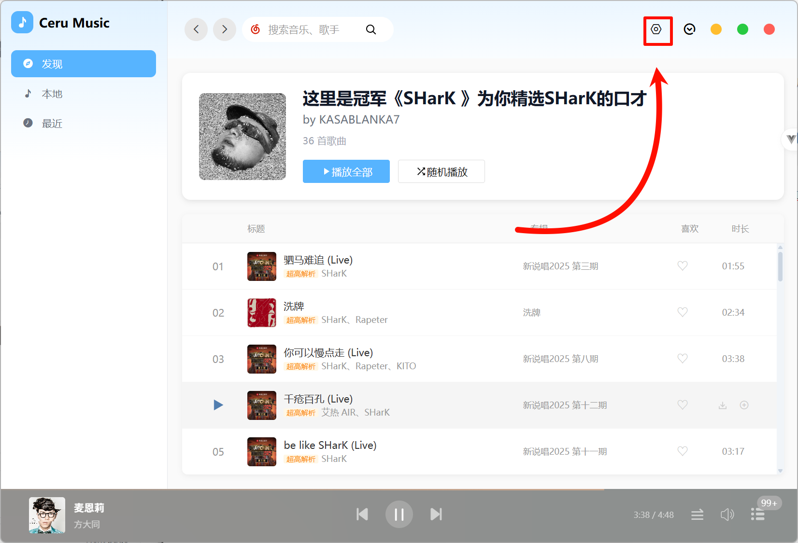
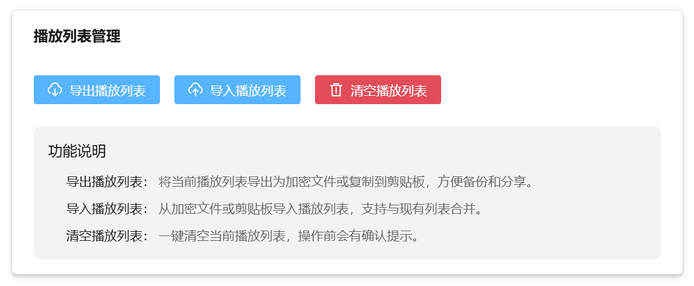
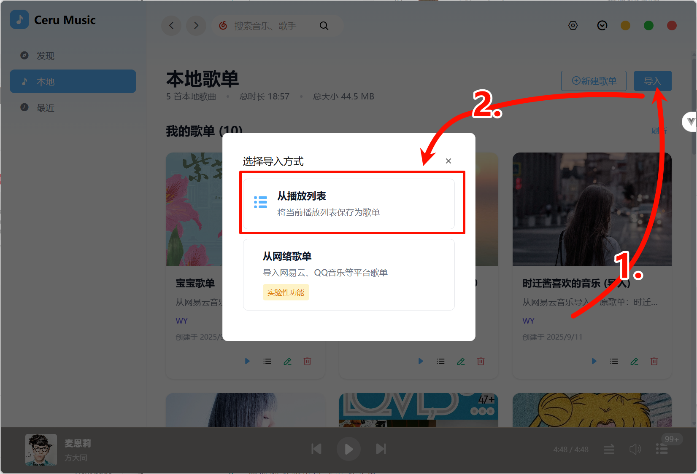

# 音乐播放列表-机制分析

## 基础使用

1. 默认情况下，播放 **「搜索」「歌单」** 双击中的歌曲时，会自动将该歌曲添加到 **「列表」** 中的末尾后并不会播放，这与手动将歌曲添加到 **「列表」** 等价，亦或是通过点击歌曲前面小三角播放可以添加到歌曲开头也可进行该歌曲添加到 **「列表」** 中的开头并播放。歌曲会按照你选择的播放顺序进行播放。
2. 对于 **「列表」** 歌曲的顺序可通过展开长按 **1.5s** 后可以进行拖拽排序，歌曲排序实时保存到本地 **LocalStorage**

## 歌曲列表的导出和分享

3. 可进入设置

   

   点击 **[播放列表]** =>

   

   即可操作你想要的功能

4. 播放列表还可以导出为歌单

   

   歌单将自动选取第一首 **有效封面**[^1] 为歌单

[^1]: url正确的歌曲封面
