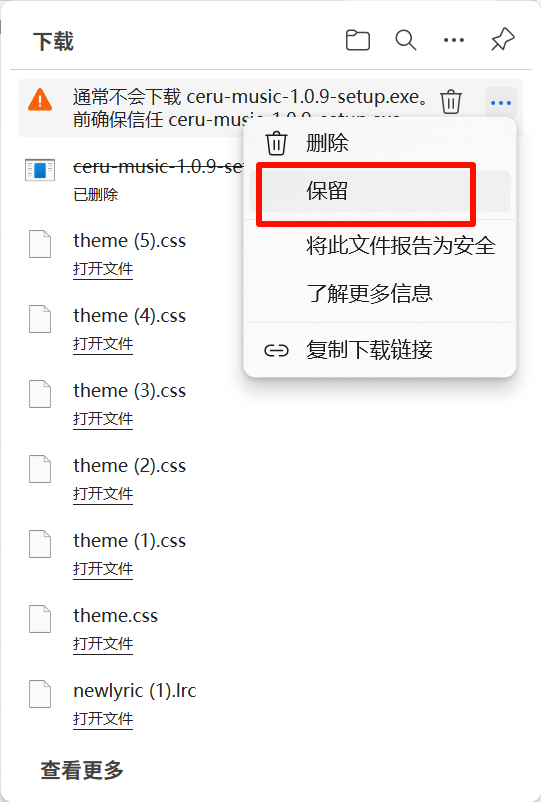

# CeruMusic 使用教程

## 1. 软件下载

​		由于我们团段都是个人开发者原因 暂时无能力部署到 `OSS` 承担高下载量的能力，供大家下载只能通过[Github](https://github.com/timeshiftsauce/CeruMusic)下载安装使用

### Window 安装

由于没有证书原因 **`Window`** 平台可能会出现安装包体误报**危险**。请放心我们的软件都是**开源**在 `Github` 自动化打包的。**具体安装步骤如下**

如果出现类似图例效果请先点击 **右侧 三个点**

**点击保留**